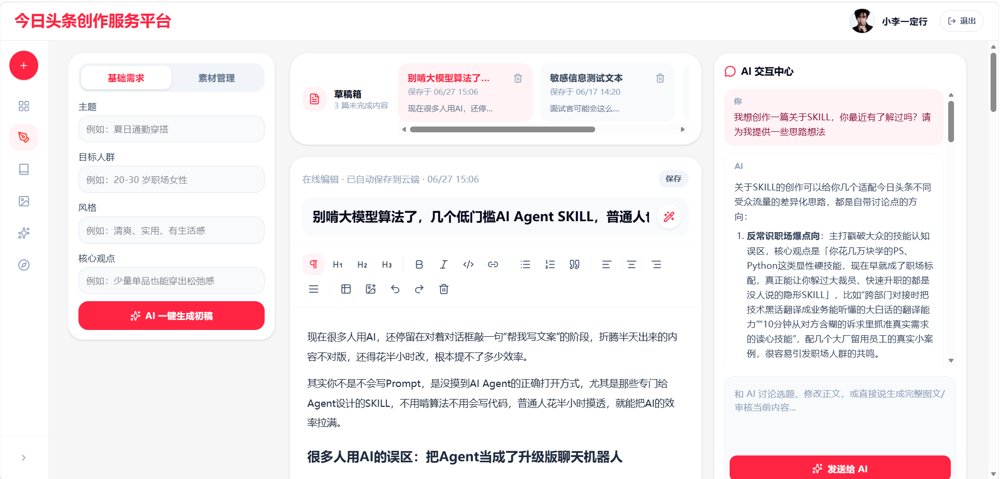
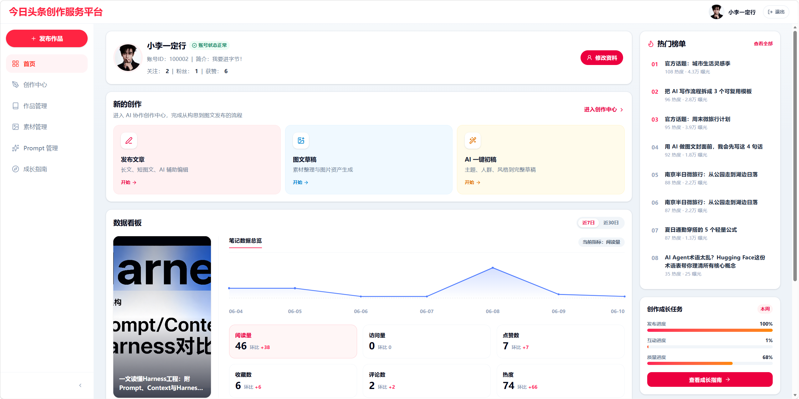
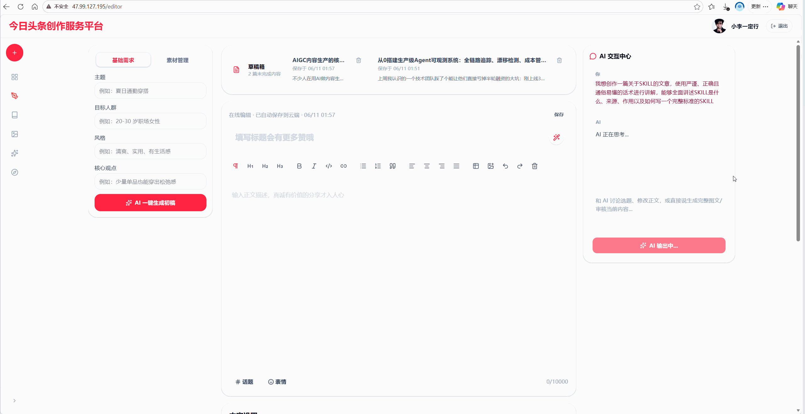
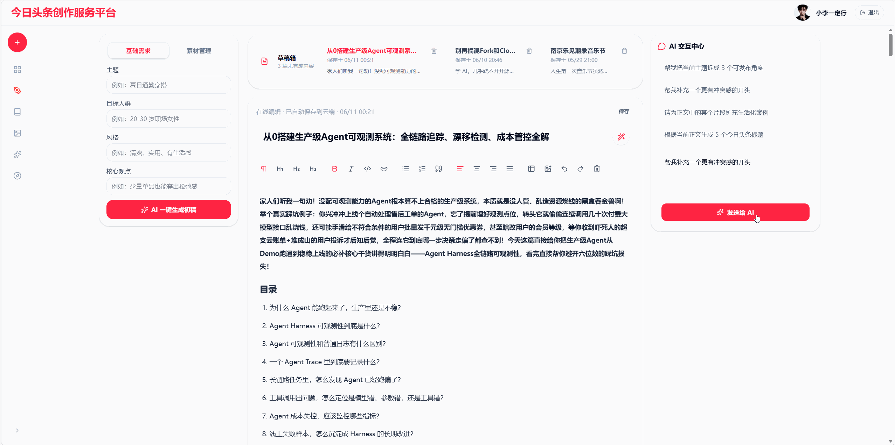
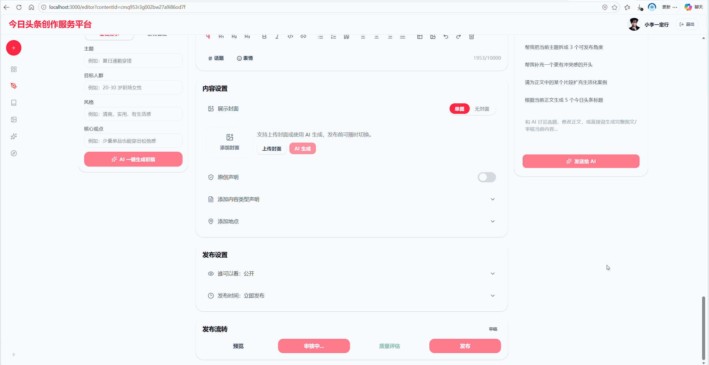
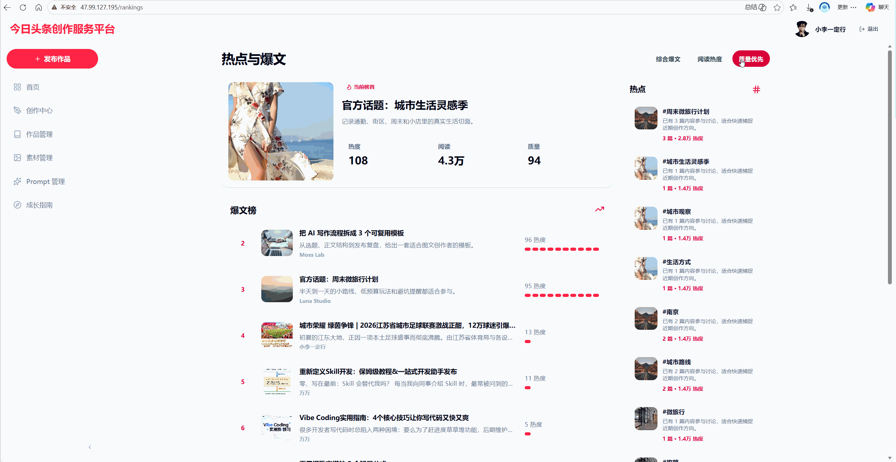
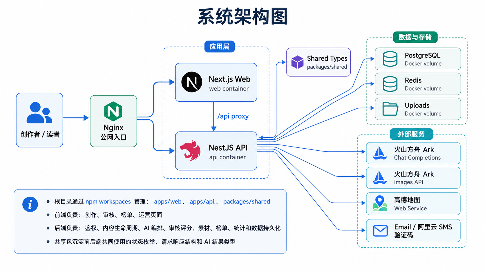

# AI 创作者辅助生产与分发平台

这是一个面向图文内容创作者的 AI 内容生产平台，覆盖选题、连续创作、标题与局部改写、图文生成、配图、内容安全审核、质量评分、发布分发和数据反馈等流程。

项目由 Next.js Web、NestJS API、独立 AI Worker 和共享类型包组成；PostgreSQL 保存业务事实与永久会话归档，Redis 承担缓存、分布式协调、BullMQ 队列及实时事件加速。模型层同时支持火山方舟 Chat Completions、Responses 和 Images API。

## 项目预览

### AI 创作中心



创作者可以在同一工作台中完成需求输入、AI 初稿生成、富文本编辑、素材管理、自动保存以及与 AI 助手的连续对话。

### 创作与数据看板



看板汇总账号信息、创作入口、作品指标、热门榜单和成长任务，帮助创作者跟踪内容发布后的反馈。

## 功能演示

### AI 一键生成图文



根据主题、目标人群、风格和核心观点生成结构化图文草稿，并持续反馈需求分析、文章写作、视觉规划和图片生成状态。

### AI 对话式创作



通过 Responses 会话链进行持续创作；本地永久保存完整消息，并在远端会话失效或轮换后从摘要和近期消息恢复上下文。

### 内容审核



规则引擎先召回候选风险，大模型再结合标题、正文和完整语境进行独立复核，并可主动发现规则未命中的语义风险。

### 榜单与内容分发



公开内容会进入阅读、榜单和话题分发链路，并结合浏览、点赞、收藏和评论形成反馈数据。

更多演示素材：

- 创作辅助：[智能标题](./docs/media/智能标题.gif) · [文本扩写](./docs/media/扩写.gif) · [自动保存](./docs/media/自动保存.gif) · [生成封面图](./docs/media/生成封面图.gif)
- 生产流程：[一键生成初稿](./docs/media/一键生成初稿.gif) · [审核通过](./docs/media/内容审核成功.gif) · [质量评估](./docs/media/质量评估.gif)
- 内容运营：[作品管理](./docs/media/作品管理.gif) · [内容发布](./docs/media/内容发布.gif) · [浏览与互动](./docs/media/浏览与互动.gif)

## 核心功能

- 用户与鉴权：支持邮箱/手机号注册、验证码、登录会话和个人资料管理。
- AI 创作助手：支持多轮对话、标题生成、选中文本润色/扩写/改写，以及完整图文生产。
- 多阶段图文生产：将需求分析、文章写作、视觉规划、结果校验和失败修复拆分为可观测阶段，并支持阶段检查点恢复。
- AI 图片生成：调用火山方舟 Images API 生成封面和正文配图，保存为素材并等待前端确认提交。
- 内容安全审核：组合词库、正则、组合规则、上下文排除和 LLM 语义审核，输出风险项、规则复核项、类别置信度和修改建议。
- 合规改写与质量评分：未通过内容可进入合规改写；质量评分只接受与当前文章内容哈希一致的有效审核结果。
- 内容管理与发布：支持草稿、自动保存、富文本、版本管理、审核后发布、定时发布和下线。
- 分发与反馈：包含榜单、话题、阅读、点赞、收藏、评论和数据看板。
- Prompt 与评测：支持数据库 Prompt 版本、代码默认回退、测试用例、dry-run 和高危审核回归集。
- AI 调用观测：记录模型、API 风格、会话 ID、Token、缓存命中、首 Token 延迟、总耗时、重建原因和调用结果。

## 关键技术设计

### 1. 可靠的异步 AI 任务调度机制

编辑区中的 AI 操作统一提交为 `AiJob`，由 API、事务 Outbox、BullMQ 和独立 Worker 协作执行：

1. API 使用 Zod 校验任务载荷、校验内容归属，并保证重复提交只创建一个业务任务。
2. 同一数据库事务写入 AI 任务、初始持久化事件和待投递记录。
3. Outbox 派发器再投递至 BullMQ；多 API 实例可并行派发而不会重复领取同一记录。
4. Worker 按任务类型执行模型调用，持续写入进度、阶段检查点和可恢复的 SSE 事件。
5. 可重试故障交由 BullMQ 指数退避；Outbox 退避只处理“数据库任务尚未成功投递到队列”的故障，两者职责分离。
6. 完整图文和图片结果进入 `awaiting_commit`，浏览器通过带事件 ID 与载荷哈希的提交接口原子落库，避免刷新、重试或多标签页导致重复覆盖。

### 2. 多轮会话与上下文管理

- 正常续轮只发送当前新消息和上一条消息 id，并启用存储和缓存。
- PostgreSQL始终保存完整消息，是永久归档和重建事实来源。
- 同一会话由 Redis 分布式锁串行执行。
- 文章内容未变化时通过内容哈希省略重复正文；内容变化时发送最新编辑器快照。
- 默认使用结构化摘要和最近 12 条原始消息。摘要只用于压缩上下文，不删除原始消息。
- 将稳定的 system prompt、JSON Schema 和阶段资源放在前面，动态输入放在后面，以利用上下文前缀缓存。

### 3. Structured Outputs 与统一 Zod 校验

所有结构化智能体都可以定义自己的 Zod Schema，但复用同一个执行链路：

1. 将 Zod Schema 转换为严格 JSON Schema。
2. 对返回 JSON 执行 JSON 解析和 Schema 校验。
3. 校验失败时，将上一次输出和精简后的 issues 作为修复上下文再次调用模型。
4. 超过自动修复轮次后统一抛出问题，由任务重试策略决定是否重试整个调用。

除类型校验外，生产线还限制对象深度、字符串长度、数组规模、图片/素材数量和危险原型字段，防止“Schema 合法但业务不可用”的结果进入持久化。

### 4. 可恢复的多阶段内容生产线

完整图文生成不再依赖一个超长 Prompt 一次完成，而是由程序显式编排：

1. 需求分析：整理主题、受众、目标、风格和约束。
2. 文章写作：基于已确认需求生成标题、正文、标签和摘要。
3. 视觉规划：生成封面与正文插图方案。
4. 确定性合并与校验：代码合并阶段结果并运行可信校验脚本。
5. 失败修复：只有最终结果不满足约束时才加载输出规范化 Prompt 进行修复。
6. 图片生成：限制并发、记录 key，并允许部分图片失败时保留可用文本结果。

Skill 资源用于管理阶段 Prompt、参考资料、视觉预设和校验脚本；真正的阶段顺序、输入输出传递、重试和检查点仍由应用代码控制，保证流程可测试、可恢复和可观测。

### 5. 内容安全审核链路

审核采用“规则召回 + LLM 独立语义判断 + 确定性合并”的分层架构：

```text
标题/正文
   ↓
词库、正则、组合规则、上下文排除
   ↓ 候选风险线索
LLM 阅读完整文章：复核每条规则命中 + 主动发现漏召回风险
   ↓
JSON Schema + Zod 校验与自动修复
   ↓
风险去重、重叠合并、误报抑制、严重度与类别分数归并
   ↓
通过 / 驳回 / 合规改写 / 质量评分与发布门禁
```

当前高危回归集结果见 [评测指标](./docs/evaluation/high-risk-eval-current-full-llm-metrics.json)：高危召回率 100%、精确率 93.33%、F1 96.55%、总体准确率 96.67%、风险等级完全匹配率 90%。

## 系统架构



- Web：页面渲染、富文本编辑、自动保存、AI Job 提交/订阅和结果确认。
- API：鉴权、业务校验、内容生命周期、会话归档、Outbox 派发、SSE 和结果提交。
- Worker：独立消费 BullMQ 任务，执行智能体、审核、生产线、图片生成和会话压缩。
- PostgreSQL：业务数据、完整消息、远端会话游标、摘要、任务、Outbox、持久化事件、检查点和调用日志。
- Redis：cache-aside、会话锁、BullMQ、取消信号和实时通知。

## 技术栈

| 层级 | 技术 |
| --- | --- |
| 前端 | Next.js 14、React 18、Tiptap 3、Tailwind CSS 4、TypeScript |
| 后端 | NestJS 10、Prisma 5、Zod 4、BullMQ 5、ioredis、sanitize-html、Sharp |
| 数据 | PostgreSQL 14、Redis 7 |
| AI | 火山方舟 Chat Completions、Responses、Images API，原生 JSON Schema Structured Outputs |
| 工程化 | npm workspaces、Docker Compose、Vitest、ESLint |

## 目录结构

```text
.
├─ apps/
│  ├─ api/                 # NestJS API、AI Worker、Prisma Schema 与迁移
│  │  └─ src/skills/      # 内容生产与安全审核的 Prompt、参考资料和校验脚本
│  └─ web/                 # Next.js 页面、编辑器和 AI Job 前端协议
├─ packages/shared/        # 前后端共享 DTO、枚举、任务和工作流类型
├─ docs/                   # 演示素材、设计文档和评测结果
├─ infra/                  # PostgreSQL / Redis 本地基础设施
└─ package.json            # workspace 统一脚本
```