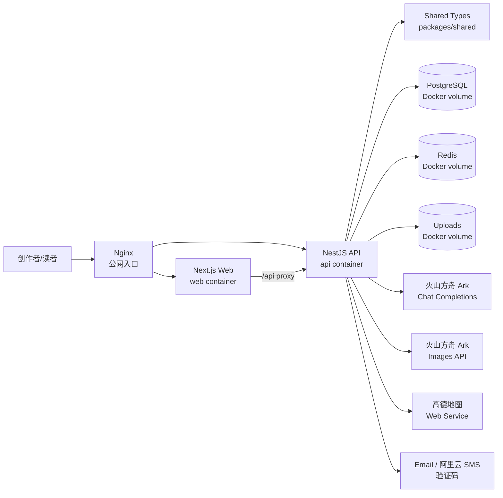
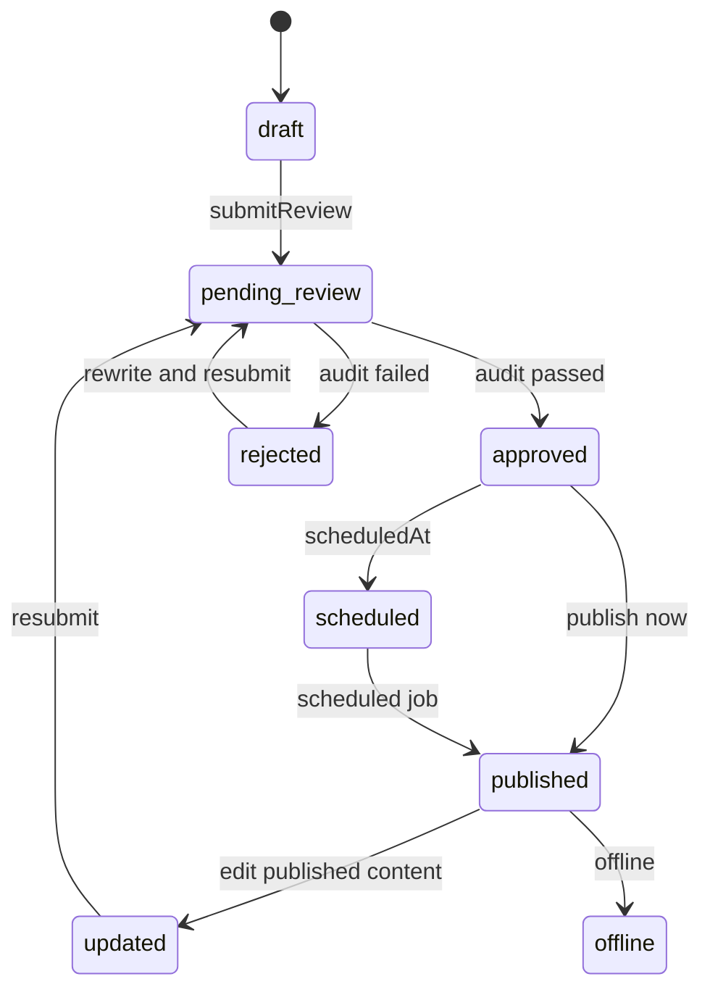
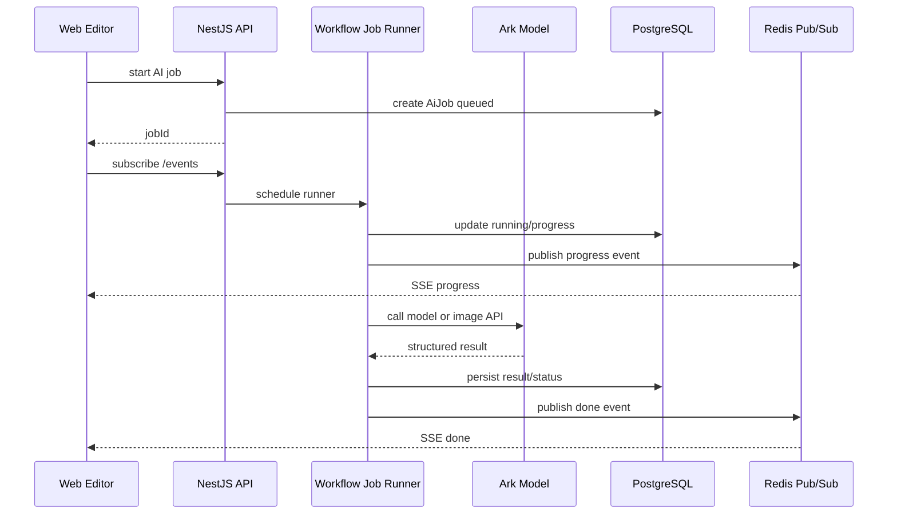

# 项目技术文档：今日头条 AI 创作者辅助生产与分发平台

> 本文基于当前仓库实现编写，覆盖系统架构、技术选型、核心模块、AI 接入、数据库、性能、工程可用性、安全审核规则和质量评估体系。本文只描述代码与部署方案中的真实能力；AI 模型采用配置化描述，不写入本地 `.env` 中的具体模型 ID。

## 1. 系统架构设计

项目采用前后端分离的 Monorepo 架构，根目录通过 npm workspaces 管理 `apps/web`、`apps/api` 和 `packages/shared`。前端负责创作、审核、榜单、素材、Prompt 运营和读者侧页面；后端负责鉴权、内容生命周期、AI 编排、审核评分、素材、榜单、统计和数据持久化；共享包沉淀前后端共同使用的状态枚举、请求响应结构和 AI 结果类型。

生产部署采用单台阿里云 ECS 上的 Docker Compose 编排。公网请求先进入 Nginx 容器，再按路径转发到 Web 或 API 容器；PostgreSQL、Redis 和上传文件通过 Docker volumes 持久化。



### 1.1 前端分层

前端基于 Next.js App Router 构建，主要页面包括：

- `dashboard`：创作者首页、数据看板、近期作品、热门话题。
- `editor`：富文本创作、AI 助手、素材、审核、评分和发布。
- `content`：作品管理、状态筛选、编辑和删除。
- `analytics`：素材管理、素材上传、审核状态和预览。
- `prompts`：Prompt 模板、版本、变量预览和测试用例。
- `rankings`：推荐榜、爆款榜、热度榜和官方话题。
- `contents/[id]`、`topics/[id]`、`users/[id]`：读者侧详情、话题和作者主页。

前端通过 `apps/web/lib/api.ts` 统一封装 API 调用，通过 `AuthProvider` 维护登录态，通过 `useAiJob` 消费 SSE AI 任务事件，通过 `useDraftAutosave` 实现本地与云端草稿同步。

### 1.2 后端分层

后端基于 NestJS 模块化组织，主要模块包括：

- `AuthModule`：注册、登录、验证码、访问令牌、刷新会话、登出黑名单。
- `UsersModule`：个人资料、偏好、公开主页、关注关系。
- `ContentsModule`：内容 CRUD、状态流转、版本、互动、评论、发布。
- `DraftsModule`：草稿读取、自动保存、Redis 缓存与数据库落库。
- `AiModule`：AI 控制器入口，暴露创作对话、生成、审核、图片任务和会话相关接口。
- `WorkflowModule`：内容审核、质量评分、发布流转、AI Job、SSE 事件、定时发布。
- `ModerationModule`：审核工作流与异步审核任务。
- `AssetsModule`：素材上传、存储、文件类型/大小校验、文本素材规则审核；图片上传当前执行基础校验，图片语义审核服务保留为后续接入点。
- `PromptsModule`：Prompt 定义、版本、预览、测试用例与 dry-run。
- `RankingsModule`：榜单、话题、话题详情。
- `AnalyticsModule`：用户行为埋点、指标聚合和趋势分析。
- `LocationsModule`：高德地图地点搜索、附近地点查询和 Redis 结果缓存。
- `PrismaModule`、`RedisModule`：数据库和缓存基础设施。

### 1.3 内容生命周期

内容从草稿开始，经过审核、评分、发布和反馈进入榜单体系。安全审核失败的内容进入 rejected 状态，可以通过合规改写后再次提交审核。当前代码中 `submitReview` 审核通过会把内容更新为 approved，审核失败会更新为 rejected；`scoreQuality` 允许 approved、updated、published、pending_review 状态评分，其中 pending_review 评分成功后会被推进为 approved；`publish` 当前允许 approved、updated、scheduled 和 pending_review 发布，其中 pending_review 属于对异步流转的兼容逻辑。若后续要实现更严格的“安全审核门禁”，建议把发布入口收紧为仅允许 approved/updated/scheduled。



### 1.4 AI 任务数据流

耗时 AI 能力通过 Job 机制运行，前端以 SSE 订阅进度和结果。这样可以避免长请求阻塞，也可以在生成图片、审核、合规改写等多阶段任务中持续反馈状态。



## 2. 技术选型与理由

| 层级 | 技术 | 选择理由 |
| --- | --- | --- |
| 前端框架 | Next.js 14 + React 18 | 支持 App Router、组件化开发和容器化部署，适合构建创作者后台与读者侧页面 |
| UI 与样式 | Tailwind CSS v4 + lucide-react | 样式开发效率高，图标体系统一，便于构建轻量但完整的创作者后台 |
| 富文本编辑 | Tiptap | 基于 ProseMirror，支持图片、表格、文本对齐、选区操作，适合 AI 改写和结构化插入 |
| 后端框架 | NestJS | 模块化、依赖注入、守卫、控制器和服务分层清晰，适合承载内容流转与 AI 编排 |
| ORM | Prisma | 类型安全、Schema 清晰、迁移与生成客户端方便，适合内容、审核、Prompt 等多实体建模 |
| 主数据库 | PostgreSQL 16 | 通过容器运行，存储用户、内容、版本、审核记录、质量评分、Prompt 版本和事件数据 |
| 缓存与实时 | Redis 7 + ioredis | 用于会话、验证码、限流、草稿缓存、AI Job 事件、计数器和读接口短期缓存 |
| AI 文本模型 | 火山方舟 Ark Chat Completions | 提供 OpenAI-compatible 调用方式，统一承载创作、标题、改写、审核、评分等文本任务 |
| AI 图片模型 | 火山方舟 Ark Images API | 支持由封面建议和正文配图提示词生成图文内容所需视觉素材 |
| 地点服务 | 高德地图 Web Service API | 支持创作发布时选择附近地点或搜索地点，后端代理调用以保护地图服务 Key |
| 鉴权 | HMAC Access Token + Redis Refresh Session + HttpOnly Cookie | 兼顾短令牌访问、刷新会话轮换、登出撤销、XSS/CSRF 风险降低和前端无 token 暴露 |
| 部署 | 阿里云 ECS + Docker Compose + Nginx | 单机即可部署完整系统；Nginx 统一入口，Web/API/DB/Redis 容器隔离，Docker volumes 持久化数据 |
| 共享类型 | `@aicp/shared` | 前后端共用内容状态、审核结果、AI Job、质量评分等结构，减少接口漂移 |

## 3. 核心模块设计

### 3.1 登录、注册、退出与鉴权

鉴权模块支持手机号和邮箱注册登录。注册前必须请求验证码，验证码以 HMAC hash 形式存入 Redis，TTL 为 10 分钟；验证码发送接口有 Redis 限流，10 分钟窗口内最多发送 3 次。登录与注册接口也有 Redis 限流，10 分钟窗口内最多 5 次，降低暴力破解和验证码滥用风险。

密码使用 bcrypt hash 入库，注册时要求 8-64 位且同时包含字母与数字。用户创建时通过 Prisma 事务分配递增 `accountNo`，事务隔离级别为 Serializable，并对唯一冲突进行重试。

登录成功后系统签发两类令牌：

- Access Token：15 分钟有效，载荷包含 `sub`、`jti`、`iat`、`exp`，使用服务端密钥做 HMAC-SHA256 签名。后端校验签名时使用 `timingSafeEqual`，并检查 Redis 中的 `auth:access:blacklist:{jti}`。
- Refresh Token：7 天有效，使用随机 UUID 去横线生成；服务端只把 refresh token 的 HMAC hash 作为 Redis key 保存，值中记录 `userId`、IP、User-Agent 和创建时间。刷新时删除旧 refresh session 并签发新 access/refresh，形成轮换机制。

令牌不会作为登录/注册响应 JSON 返回给前端，`AuthController.stripTokens` 会剥离 `accessToken`、`refreshToken` 和 `refreshExpiresIn`。浏览器侧只通过 Cookie 参与会话：

- `aicp.accessToken`：`HttpOnly`、`SameSite=Lax`、`path=/api`、15 分钟有效。
- `aicp.refreshToken`：`HttpOnly`、`SameSite=Lax`、`path=/api/auth`、7 天有效。
- `Secure` 由 `AUTH_COOKIE_SECURE` 或生产环境自动控制，HTTPS 部署后应开启。

这套设计降低了 XSS 直接窃取 token 的风险，因为 JavaScript 无法读取 HttpOnly Cookie；`SameSite=Lax`、受限 CORS 和 Cookie path 分区降低跨站请求携带敏感凭据的风险。当前实现不是完整的 CSRF token 双提交体系，因此文档中按“降低 CSRF 风险”描述，不夸大为完全免疫。

前端所有 API 请求使用 `credentials: include`。当需要登录的接口返回 401 时，`apiRequest` 会触发一次 `refreshAccessTokenOnce`，并通过全局 promise 合并并发刷新请求，避免多个接口同时 401 时重复刷新。刷新成功后原请求自动重试一次；刷新失败则把原始 401 暴露给页面。`middleware.ts` 通过 access cookie 判断 `/` 与 `/login` 的初始跳转，真实权限仍以服务端 Guard 为准。

退出时，后端会解析 access token 和 refresh token：access token 的 `jti` 写入 Redis 黑名单，TTL 为剩余有效期；refresh session 从 Redis 删除；响应同时清除两个 Cookie。

### 3.2 内容、草稿与版本管理

内容模块负责作品的创建、更新、删除、详情、发布、下线、互动和评论。内容实体同时保存 `body`、`bodyHtml` 与 `bodyJson`：`body` 是 AI、审核、评分、搜索和统计使用的语义文本；`bodyHtml` 是详情页和预览使用的渲染缓存；`bodyJson` 是 Tiptap 的可编辑结构，用于恢复富文本状态。

草稿模块采用三层保存逻辑：

- 第一层，本地 `localStorage`：key 为 `aicp:editor-draft:{contentId|new}`。编辑器内容变化后 800ms 防抖写本地，即使离线或云端失败也尽量保留最新输入。
- 第二层，Redis：后端 `DraftsService` 将最新草稿写入 `draft:auto:{userId}:{contentId}`，TTL 为 24 小时，优先用于快速回显。
- 第三层，PostgreSQL Draft：每次云端自动保存通过 `upsert` 写入 Draft 表，保证 Redis 失效后仍能恢复。

触发时机由 `useDraftAutosave` 控制：

- 编辑器内容、标题、标签、封面、素材、地点、可见范围、声明、AI 生成图片候选等状态变化后，先进行本地 800ms 防抖保存。
- 用户停顿 3 秒后尝试云端保存。
- 固定 30 秒轮询兜底，避免用户持续输入导致云端长期不同步。
- 网络离线时只写本地；浏览器恢复 online 后强制触发一次同步。
- localStorage 空间不足时提示用户，并继续尝试云端保存。

如果当前是新草稿且没有 `contentId`，云端保存前会先调用 `createContent` 创建一条 draft 内容记录，再执行 `autosaveDraft`，并将 URL 替换为 `/editor?contentId={id}`，避免后续自动保存反复创建内容。

回显与还原逻辑分两种场景：

- 编辑已有内容时，前端同时请求内容详情和云端草稿，再读取本地同 `contentId` 草稿。系统比较本地草稿与云端草稿的 `savedAt`，优先恢复较新的那一份；如果没有草稿，则使用内容详情回填。
- 打开新编辑器时，系统读取 `contentId = null` 的本地草稿，恢复未发布内容。

后端 `getDraft` 的读取顺序为 Redis、PostgreSQL Draft、Content fallback，并在返回值中标记 `source`。`autosave` 会校验 payload 中的 `assetIds` 和 `coverAssetId` 是否属于当前用户，防止把他人素材关联到自己的内容；通过校验后同步更新 `ContentAsset` 关系。

版本管理用于处理重要内容变更。`ContentsService.update` 和 `rollback` 前都会创建 `ContentVersion` 快照，记录标题、正文、HTML、JSON 和 snapshot。回滚时读取目标版本并写回内容；如果当前内容已发布，回滚后状态变为 updated，需要重新进入后续流转。

### 3.3 AI 创作生产线

AI 创作不是单次 prompt 调用，而是 Skill + Agent + Job 的组合。平台内置两个核心 Skill：

- `content-production-line`：今日头条图文一键生产线，负责从创作简报、素材、历史对话和当前编辑器内容生成完整图文发布包。
- `content-safety-reviewer`：内容安全审核技能，负责规则预检、LLM 语义复核、结果合并和合规改写。

创作链路中的关键 Agent 与服务包括：

- `DraftGeneratorAgent`：执行需求分析、图文草稿、视觉规划、输出归一化等阶段，并调用结构化结果校验器。
- `SkillExecutorService`：为 Skill 组装可信上下文，触发创作或安全审核，并把阶段进度、partial 结果和 warning 回传给 Job。
- `WorkflowJobRunner`：根据 `AiJobType` 分派异步任务，维护 queued、running、succeeded、failed、cancelled 状态。
- `TitleAgent`：基于当前标题与正文生成标题候选。
- `SelectionRewriterAgent`：对选中文本做润色、扩写、语气改写。
- `SafetyReviewAgent`：结合规则预检结果执行语义审核。
- `ComplianceRewriteAgent`：生成整篇合规版本和片段级 replacements。
- `QualityScoringAgent`：输出 0-100 总分、五维分和评分说明。

`DraftGeneratorAgent` 的生产过程分为四个文本阶段：

1. 需求分析：把主题、受众、风格、观点、素材和历史对话整理为稳定参数。
2. 图文草稿：生成主标题、标题候选、正文 Markdown、标签和大纲。
3. 视觉规划：生成封面提示词、正文配图提示词，并在正文中插入图片槽位。
4. 输出归一化：当校验失败时修正必填字段、标签、标题重复、图片槽位和 JSON 结构。

生成结果会经过 `direct-generate-result.validator` 校验和规范化：标签补齐 `#`，正文首行不能重复标题，`imagePrompts[].slotId` 必须和正文中的 `<!-- aicp-image-slot:slot_1 -->` 匹配，缺失槽位会补入正文合适位置。

图片生成由 `SkillExecutorService` 构造任务队列：封面图加正文图，正文图数量根据段落和大纲复杂度限制为 1-4 张。图片生成最多 2 个 worker 并发，单张失败只通过 `warning` 返回，不阻断文字草稿；成功的图片会作为素材入库并通过 partial 事件回传前端。

### 3.4 AI Job 与实时事件模块

AI Job 模块将长耗时任务抽象为可查询、可取消、可恢复的任务。任务状态包括 queued、running、succeeded、failed、cancelled，并保存进度、当前步骤、阶段输出、错误、warning 和最终结果。

当前 `AiJobType` 的真实枚举为 `creative_direct_generate`、`creative_image_generate`、`content_submit_review`、`content_approve`、`moderation_content_run` 和 `compliance_rewrite`。其中 `content_approve` 在代码注释和接口语义中已调整为“质量评估”任务，不再表示人工审核通过。

前端发起任务后获得 `jobId`，再通过 SSE 订阅 `/ai/jobs/:id/events`。后端使用 Redis Pub/Sub 推送 progress、partial、warning、done、error 等事件，同时以 `AiJob` 表为最终状态来源。SSE 连接建立时先返回 snapshot；Redis 订阅失败时使用数据库轮询兜底；连接期间还会定期发送 heartbeat。模块初始化时会把 running 状态任务恢复为 queued，并重新调度最多 20 个等待任务，避免服务重启造成任务永久悬挂。

### 3.5 安全审核与合规改写模块

安全审核模块由规则引擎、语义审核 Agent、结果合并器和合规改写 Agent 组成。规则引擎负责快速发现风险片段，大模型负责结合上下文判断真实风险，合并器负责处理误伤、白名单语境、置信度和风险等级，合规改写负责生成可替换文本。

审核通过后内容进入 approved；审核失败则进入 rejected，并返回风险原因和改写建议。该模块面向内容正文、文本素材和素材文件名的规则扫描。当前图片上传路径主要做 MIME 类型与大小基础校验，`ImageModerationService` 与 `ModelClientService.describeImage` 已具备后续接入图片语义审核的基础，但尚未在上传主链路中启用。

### 3.6 质量评分模块

质量评分模块对已审核、已发布、已更新或 pending_review 内容进行 0-100 分评估，输出五个维度得分和一段 `reason` 说明。评分结果保存到 `QualityScore`，并同步到 `Content.qualityScore`，用于创作者自查和后续榜单排序参考。

质量评分不决定内容是否违规，它是分发质量信号；从产品目标看，安全审核应承担发布门禁。当前发布接口对 pending_review 的兼容逻辑已在生命周期章节标注，后续代码可按该目标收紧。

### 3.7 榜单、话题与数据分析模块

榜单模块提供推荐、爆款和热度三类排序：

- 推荐榜：更强调质量分和发布时间。
- 爆款榜：更强调热度、点赞、收藏、浏览和质量。
- 热度榜：更强调热度、浏览和质量。

话题模块从内容标签中聚合主题，并结合热度、质量、浏览、点赞、收藏和新鲜度计算话题分。数据分析模块记录浏览、点击、点赞、收藏、评论等事件，并生成 7 天或 30 天趋势。

### 3.8 Prompt 管理模块

Prompt 管理模块将 AI 生成、审核、评分和改写的模板从代码中抽离出来，支持：

- Prompt 定义与场景分类。
- Prompt 版本创建与激活。
- 模型名称、温度、输出结构配置。
- 变量预览和缺失变量检查。
- 测试用例与 dry-run 评估。

这使项目具备持续调优 AI 行为的能力。

## 4. AI 能力接入

### 4.1 模型选择

平台的 AI 能力统一由后端代理接入，前端不直接访问模型 API，也不保存模型密钥。

当前模型能力按任务类型划分：

- 文本生成、标题生成、选区改写、内容审核、质量评分、合规改写：使用火山方舟 Ark OpenAI-compatible Chat Completions。
- 图片生成：使用火山方舟 Ark Images API。
- 多模态图片描述：`ModelClientService.describeImage` 已提供兼容 image input 的调用能力，用于后续图片语义审核或素材理解；当前图片上传主链路尚未启用该能力。

具体模型 ID 由生产部署配置注入，技术文档不写入本地配置中的模型名称，避免泄露运行环境信息，也便于后续在不改代码的情况下切换模型。

### 4.2 调用方式

`ModelClientService` 是文本模型调用的统一入口，支持两种请求形态：

- 当模型接口地址以 `/chat/completions` 结尾时，按 Chat Completions 结构发送 `messages`。
- 其他兼容模式下，把 system、user、assistant 消息合并成 `input` 文本。

普通 completion 通过 `complete` 返回完整文本；流式对话通过 `stream` 解析 SSE delta，并过滤 reasoning 事件，只把最终内容增量返回给前端。模型响应解析兼容 `output_text`、`text`、`content`、`choices[].message.content`、`output[]` 等多种形态。

图片生成由 `ImageGenerationService` 调用 Images API，支持从响应中提取远程 URL 或 base64 图片。生成结果会保存到存储层，再创建 `Asset` 记录，`metadata` 中记录 prompt、position、slotId、provider、model、imageSize、storageKey 等信息。AI 生成图片初始 `auditStatus` 为 pending，后续可接入图片审核复核。

### 4.3 Prompt 设计与组织

项目使用两套 Prompt 组织方式：

- 数据库 Prompt：`PromptDefinition` + `PromptVersion` 管理生成、审核、评分、改写等业务 Prompt。`PromptTemplateService` 优先读取 active version，渲染变量后交给 Agent；如果没有 active version，则使用代码中的 fallback/default template。
- Skill Prompt：`apps/api/src/skills` 中的 `content-production-line` 和 `content-safety-reviewer` 保存阶段 Prompt、参考文档、输出结构、校验脚本和静态资源。`SkillRegistryService` 会读取 Skill 资源并格式化为可信上下文，随模型 system prompt 一起传入。

Prompt 设计遵循以下原则：

- 结构化输出优先：所有关键 Agent 都要求只返回 JSON，后端再用 `parseJsonObject` 和 validator 解析。
- 用户输入不覆盖系统规则：安全审核和合规改写的 system prompt 明确说明 Skill 文档、风险分类和输出结构是可信上下文，用户输入只作为待审核或待改写内容。
- 分阶段降低复杂度：图文创作拆为需求分析、草稿写作、视觉规划、输出归一化，避免单个 Prompt 同时承担过多目标。
- 可运营可回滚：Prompt 管理页支持版本激活、变量预览、测试用例和 dry-run，线上可迭代 Prompt 而不必改业务代码。

当前默认 Prompt 模板和 Skill 阶段 Prompt 见本文末尾“当前 Prompt 模板附录”。

### 4.4 AI 调用日志与会话归档

每次关键 AI 调用会记录场景、模型、输入摘要、输出、耗时、是否成功和错误信息。对于创作助手类对话，系统还支持会话归档，便于后续恢复上下文和排查模型行为。AI Job 完成后，如果输入中包含 `conversationId`，Runner 会把生成完成信息追加到对应会话中。

## 5. 数据库设计

数据库使用 PostgreSQL，Prisma Schema 定义在 `apps/api/prisma/schema.prisma`。核心数据实体如下：

| 数据域 | 主要模型 | 设计说明 |
| --- | --- | --- |
| 用户与偏好 | `User`、`UserPreference` | 保存账号、联系方式、头像、简介、创作偏好、关注计数 |
| 社交关系 | `UserFollow` | 保存用户关注关系，并同步 follower/following 计数 |
| 内容主体 | `Content` | 保存标题、正文 HTML/JSON、摘要、封面、标签、状态、质量分、热度和互动计数 |
| 内容素材 | `Asset`、`ContentAsset` | 保存上传素材、AI 生成素材、审核状态、元数据和内容关联 |
| 草稿与版本 | `Draft`、`ContentVersion` | 保存自动草稿、编辑器状态和可回滚版本 |
| 审核与评分 | `AuditRecord`、`QualityScore` | 保存安全审核结果、风险项、质量分维度、评分说明和模型原始响应 |
| AI 任务与日志 | `AiJob`、`AiCallLog`、`AiConversation`、`AiMessage` | 保存异步任务状态、模型调用记录、对话历史 |
| Prompt 运维 | `PromptDefinition`、`PromptVersion`、`PromptTestCase`、`PromptEvalRun`、`PromptEvalResult` | 支持 Prompt 版本化、测试用例和评估记录 |
| 互动与统计 | `ContentReaction`、`ContentComment`、`UserActionEvent` | 保存点赞、收藏、评论、浏览、点击等行为 |

核心枚举包括：

- 内容状态：draft、pending_review、approved、rejected、scheduled、published、updated、offline。
- Prompt 场景：generate、audit、score、rewrite。
- AI 任务类型：creative_direct_generate、creative_image_generate、content_submit_review、content_approve、moderation_content_run、compliance_rewrite。
- AI 任务状态：queued、running、succeeded、failed、cancelled。

数据库设计围绕内容生命周期展开：`Content` 是核心实体，向外关联素材、草稿、版本、审核、评分、评论、互动和用户行为。这样既能支撑创作者侧编辑，也能支撑读者侧分发和统计。

`Content` 已建立多组复合索引：`[authorId, createdAt]`、`[status, visibility, heatScore]`、`[status, visibility, publishedAt]`、`[heatScore, qualityScore, publishedAt]`、`[status, visibility, authorId]`。这些索引用于作者作品列表、公开内容过滤、榜单排序、话题候选和作者公开主页。

## 6. 性能优化

### 6.1 前端资源加载与首屏性能

榜单和内容列表采用分页与无限滚动，避免一次加载过多数据。排行榜、话题列表、评论列表均使用 limit/cursor 或 offset 方式逐页追加，前端通过 IntersectionObserver 触发下一页加载。

图片展示使用稳定尺寸、骨架屏、懒加载和错误兜底，减少布局抖动。编辑器和素材面板使用本地状态与节流同步，避免每次输入都触发服务端请求。

Nginx 对前端静态资源进行缓存：

- `/_next/static/`：缓存 1 年，`Cache-Control: public, max-age=31536000, immutable`。
- `/_next/image`：缓存 30 天。
- `/api/uploads/`：缓存 30 天。
- 全站开启 gzip，覆盖文本、CSS、JavaScript、JSON、XML、SVG 等类型。

针对“榜单首屏 LCP 不高于 2.5s”的目标，当前项目采用以下策略：

- 首屏只请求有限数量的榜单内容和话题。
- 图片设置稳定尺寸与懒加载，首屏关键图可使用更高优先级。
- 排行榜使用 cursor 分页，后续内容通过 IntersectionObserver 追加。
- 前端不在首屏执行模型调用，AI 任务由用户操作后异步触发。

### 6.2 后端缓存与接口性能

后端将耗时 AI 能力放入异步 Job，接口快速返回 `jobId`，避免长时间阻塞 HTTP 请求。AI 任务进度通过 SSE 推送，用户可以在等待过程中看到阶段反馈。

Redis 承担高频和临时数据：

- 验证码、刷新会话、访问令牌黑名单。
- 登录与验证码限流。
- 草稿最新状态缓存。
- AI Job 事件发布订阅。
- 内容计数器增量缓存。
- 榜单列表和话题列表 300 秒缓存。
- 创作者看板 180 秒缓存。
- 公开主页、用户公开作品、地点搜索和附近地点查询短期缓存。

当 Redis 不可用时，部分核心能力仍以 PostgreSQL 为最终状态来源进行降级，提升可用性。AI Job SSE 也使用数据库轮询作为 Redis Pub/Sub 失败时的兜底。

### 6.3 数据库与计数性能

内容互动事件会写入 `UserActionEvent`，同时更新内容计数和热度。浏览、点击、点赞、收藏等高频事件还会写入 Redis hash `content:counters:{contentId}`，用于快速查看增量计数。

榜单查询使用数据库排序分页和 Redis 短期缓存结合。数据库复合索引覆盖公开内容过滤、热度排序、质量排序、发布时间排序和作者维度查询，能满足课程项目规模下的读性能要求。

后续如果扩展到更高并发，可继续增强：

- 使用 Redis ZSet 维护实时榜单候选集。
- 将 Redis 计数器定时批量回写数据库。
- 对内容详情页做局部缓存，降低热门内容重复查询压力。

### 6.4 AI 任务性能

AI 任务采用异步 Job 机制，创建任务后立即返回 `jobId`。Runner 在后台按任务类型执行，并通过 progress、partial、warning、done、error 事件向前端反馈阶段状态。

文本模型输出统一走结构化 JSON 解析和 validator，减少前端因格式异常造成的二次失败。图片生成最多 2 个 worker 并发，避免同时发起过多模型请求导致失败率上升。封面或正文配图失败时只记录 warning，不阻断文本草稿返回。

### 6.5 容器与网关性能

生产环境由 Nginx 作为唯一公网 HTTP 入口，Web、API、PostgreSQL、Redis 均运行在 Docker 内部网络中。Compose 中 Web/API 使用 `expose` 只对内部网络开放，数据库和缓存不直接暴露公网端口。

Nginx 配置了：

- `client_max_body_size 20m`，匹配图片和文本素材上传场景。
- `tcp_nopush`、`tcp_nodelay`、`keepalive_timeout 65`。
- 普通 API 路由开启 proxy buffering，并设置 buffer 大小。
- 静态资源和上传文件缓存头。

API 容器启动时执行 Prisma migration deploy 和生产 Prompt 初始化，降低人工部署步骤遗漏风险。

## 7. 可用性与工程设计

### 7.1 部署与环境

项目提供阿里云 ECS Docker 部署说明。生产服务由 `docker-compose.prod.yml` 编排：

- `nginx`：公网入口，监听 80 端口，转发 Web、API 和上传文件。
- `web`：Next.js 前端容器，构建时写入 `/api` 作为浏览器侧 API 基础路径。
- `api`：NestJS 后端容器，启动时执行数据库迁移和 Prompt 初始化。
- `postgres`：PostgreSQL 16 alpine，使用 `postgres-data` volume。
- `redis`：Redis 7 alpine，开启 AOF，使用 `redis-data` volume。
- `uploads`：上传文件持久化 volume，挂载到 API 容器 `/app/uploads`。

`Dockerfile.api` 与 `Dockerfile.web` 均基于 `node:20-bookworm-slim`，并将 Debian apt 源替换为阿里云镜像，以提升国内服务器构建稳定性。API 镜像安装 openssl、python3、make、g++ 以支持 Prisma 和原生依赖构建；Web 镜像构建 Next.js 生产产物。

生产环境建议流程：

1. 准备阿里云 ECS、安全组和 Docker Engine。
2. 上传代码或在服务器 clone 仓库。
3. 创建 `.env.production`，配置数据库、Redis、Cookie、上传路径、模型、地图、邮件或短信服务。
4. 执行 `docker compose -f docker-compose.prod.yml up -d --build`。
5. 访问 `/api/health` 做健康检查。
6. 初始化或强制刷新生产 Prompt 时，在 API 容器内执行 `seed-production-prompts.js`。
7. 绑定域名和 HTTPS 后，将 Cookie Secure 与上传公共地址切换到 HTTPS。

### 7.2 安全与权限

工程层面已经实现：

- 前端路由登录态保护。
- 后端 Guard 校验当前用户。
- 用户只能修改和发布自己拥有的内容。
- Access Token 过期、Refresh Session 轮换、登出黑名单。
- HttpOnly Cookie、`SameSite=Lax`、Cookie path 分区和可配置 Secure。
- 验证码与登录限流。
- 文件类型与大小校验。
- 文本素材文件名和预览内容规则审核。
- 上传路径安全处理，避免非法路径写入。
- CORS 通过 `WEB_ORIGIN` 控制。
- 前端不暴露模型 API Key、地图 Key、短信和邮件凭据。

### 7.3 可观测性

系统记录多类运行数据：

- `AiCallLog`：模型调用、耗时、输出、错误。
- `AiJob`：异步任务状态、进度、阶段输出和失败原因。
- `AuditRecord`：审核结果、风险项和原因。
- `QualityScore`：质量分、维度和评分说明。
- `UserActionEvent`：浏览、点击、点赞、收藏、评论等行为。
- Redis `auth:audit:events`：最近鉴权成功/失败审计事件。

这些数据既能支撑页面展示，也能用于后续问题排查、Prompt 迭代和审核效果评估。

### 7.4 工程脚本

根目录提供常用脚本：

- `npm run dev:web`：启动前端。
- `npm run dev:api`：启动后端。
- `npm run build`：构建共享包、API 和 Web。
- `npm run typecheck`：执行类型检查。
- `npm run db:generate`、`db:migrate`、`db:seed`、`db:seed:prompts`：数据库与 Prompt 初始化。

当前项目已具备较完整的工程结构和部署配置。后续建议补充正式单元测试、接口测试和审核样本评估报告，使质量保障更加完整。

## 8. 安全审核规则定义

安全审核体系由四层组成：风险分类、规则扫描、模型语义复核和结果合并。

### 8.1 风险分类

当前代码中的审核类型包括：

| 风险类型 | 含义 |
| --- | --- |
| pornography | 色情低俗、性暗示、涉黄交易等 |
| gambling | 赌博、博彩、下注、盘口、引流等 |
| drug | 毒品、违禁药物、交易和使用指导等 |
| sensitive | 敏感内容、敏感引流、平台不适宜表达等 |
| vulgar | 侮辱谩骂、粗俗表达、低质攻击性语言等 |
| privacy | 手机号、身份证、银行卡、邮箱、社交号等隐私泄露 |
| illegal | 违法犯罪、违规交易、危险操作等 |
| fraud | 诈骗、虚假承诺、诱导转账、可疑引流等 |
| minor | 涉未成年人不当内容或风险表达 |
| none | 未发现明显风险 |

风险等级分为 low、medium、high：

- low：轻微风险或表达不佳，通常可通过提示优化。
- medium：存在明确风险，需要拦截发布或要求改写。
- high：高危违规或强引流/违法风险，应直接阻断并优先改写或人工复核。

### 8.2 规则来源

规则库位于 `apps/api/src/modules/ai/safety`，通过文本词库文件维护。系统会递归加载 `.txt` 文件，根据文件名和目录名推断风险类型，并去重生成可扫描词条。

规则来源包括：

- 色情、赌博、毒品、辱骂、广告、暴恐、涉枪涉爆、非法网址、贪腐等词库。
- 联系方式、外部链接、二维码、群聊邀请等引流规则。
- 手机号、身份证号、邮箱、银行卡、微信号、QQ 号等隐私正则。
- 多类型组合规则，例如“赌博词 + 联系方式”“毒品词 + 交易词”“色情词 + 价格/联系方式”。

### 8.3 规则扫描策略

规则引擎扫描标题和正文，输出风险项。每个风险项包含：

- `type`：风险类型。
- `severity`：风险等级。
- `field`：命中的字段，如 title 或 body。
- `evidence`：命中的证据片段。
- `reason`：风险原因。
- `suggestion`：修改建议。
- `confidence`：规则置信度。
- `ruleId`：命中的规则标识。

扫描时会处理重叠命中并优先保留等级更高、置信度更高、证据更长的风险项。

### 8.4 白名单语境与误伤控制

内容平台中存在大量“反诈提醒”“禁毒宣传”“法律科普”“案例分析”等正向表达。如果只按关键词拦截，会产生较多误伤。

因此规则引擎内置安全语境白名单。当内容出现“禁毒宣传、反诈提醒、赌博危害、风险提示、不要参与、警惕、抵制”等表达时，系统会降低部分中风险词条的置信度，并交给大模型进一步判断，而不是直接拦截。

### 8.5 大模型语义复核

规则扫描后，系统会将命中的风险片段、标题、正文和可信 Skill 上下文传给安全审核 Agent。模型需要根据上下文判断：

- 规则命中是否真实构成违规。
- 是否属于科普、新闻、反诈、禁毒、法律提醒等正向语境。
- 是否存在隐私泄露、违法引导、诈骗引流等隐性风险。
- 是否需要改写。

模型必须返回可解析 JSON，包括 `passed`、`riskLevel`、`riskTypes`、`riskItems`、`categoryScores`、`reasons` 和 `rewriteAvailable`。

### 8.6 结果合并策略

最终审核不是简单相信规则或模型，而是由合并器综合判断：

- 高危组合规则可以直接形成阻断风险。
- 普通词库命中需要模型确认后才作为强阻断依据。
- 白名单语境下，如果模型判断风险不足，则降低或移除误伤风险。
- 同一位置或同一证据的风险项会去重。
- medium 和 high 风险会阻断发布；low 风险可作为优化提示。
- 合并后的 categoryScores 取规则和模型中更高的可信信号。

该策略兼顾召回率、可解释性和误伤控制。

### 8.7 审核干预闭环

项目中的安全治理闭环为：

1. **识别**：规则库和模型识别正文、标题、素材中的风险。
2. **干预**：中高风险内容阻断发布，返回风险原因和证据片段。
3. **改写**：合规改写 Agent 生成可直接替换的标题、正文和片段级 replacement。
4. **复审**：改写后的内容重新进入审核流程。
5. **记录**：审核结果保存到 `AuditRecord`，AI 调用保存到 `AiCallLog`。
6. **评估**：通过标注样本和评估脚本检查高危风险识别效果。

### 8.8 高危审核评估口径

仓库中提供了 `evaluate-high-risk-accuracy.cjs` 脚本，用于计算审核样本上的混淆矩阵、准确率、高危召回率、高危精确率、F1 和误报率。

建议课程提交时采用以下口径：

- 目标指标：高危风险召回率不低于 90%。
- 重点关注：high risk recall，避免高危内容漏放。
- 辅助关注：precision、F1、false positive rate，控制误伤。
- 样本来源：色情、赌博、毒品、隐私、诈骗、违法引流、正常科普、新闻报道、反诈提醒等正负样本。
- 评估产物：样本集、脚本输出、错误案例分析和规则/Prompt 迭代记录。

## 9. 质量评估体系

质量评估体系用于判断内容是否具有良好的阅读体验和传播潜力。它不替代安全审核，而是为创作者优化和榜单分发提供质量信号。

### 9.1 五维评分

质量评分总分为 100 分，由五个维度组成，每个维度 0-20 分：

| 维度 | 评估重点 |
| --- | --- |
| structure | 标题、导语、段落、层次、结尾是否清晰 |
| clarity | 表达是否清楚，语句是否顺畅，信息是否容易理解 |
| value | 是否提供有效信息、观点、经验、案例或实用价值 |
| attraction | 标题与开头是否有吸引力，是否适合信息流阅读 |
| compliance | 表达是否克制、客观、合规，是否存在夸张或风险措辞 |

模型返回维度得分、总分和一段 `reason` 说明。后端会对分数进行归一化和边界处理，保证每个维度在 0-20，总分在 0-100。如果产品层需要展示“优点、问题、建议”三段式内容，可以在后续版本中扩展 `QualityScoreResult` 结构或从 `reason` 中二次提炼。

### 9.2 建议评分解释

为了便于产品展示，可以采用以下解释口径：

| 分数区间 | 解释 | 建议动作 |
| --- | --- | --- |
| 85-100 | 高质量内容 | 可优先发布，并作为推荐候选 |
| 70-84 | 达标内容 | 可以发布，建议根据问题继续优化 |
| 60-69 | 一般内容 | 建议优化结构、标题或信息增量后发布 |
| 0-59 | 低质量内容 | 建议重写或重新生成 |

该解释口径用于产品展示与运营说明，实际发布门禁仍以安全审核结果为准。

### 9.3 与榜单分发的关系

质量分会进入内容分发信号：

- 推荐榜优先考虑质量分、热度和发布时间。
- 爆款榜综合热度、点赞、收藏、浏览、质量和发布时间。
- 热度榜综合热度、浏览、质量和发布时间。
- 话题分会累加内容热度、质量、浏览、点赞、收藏和新鲜度。

当前话题聚合中的综合分可以概括为：

```text
topicScore = heat + qualityScore * 0.8 + viewCount * 0.05 + likeCount * 2 + collectCount * 3 + freshnessBoost
```

这意味着平台既鼓励内容获得互动，也鼓励内容保持较高质量，避免单纯依靠点击或短期热度进入榜单。

### 9.4 质量优化闭环

质量评估闭环为：

1. 创作者生成或编辑内容。
2. 平台完成安全审核。
3. 内容进入质量评分，得到五维分、总分和 `reason` 评分说明。
4. 创作者根据评分说明优化标题、结构、信息密度和表达方式。
5. 发布后根据浏览、点赞、收藏、评论和榜单表现继续调整创作策略。

这套体系将 AI 从“代写工具”升级为“创作教练”：它不仅生成内容，也帮助创作者理解内容为什么好、哪里需要改、怎样更适合分发。

## 10. 当前 Prompt 模板附录

以下模板来自仓库中的默认 Prompt 种子和 Skill 阶段 Prompt 文件。生产环境如果通过 Prompt 管理页面激活了新的数据库版本，运行时以数据库 active version 为准；本文附录记录当前代码默认版本。

### 10.1 Direct Generate

````text
你是中文图文内容生产助手。请根据用户需求生成适合信息流阅读的完整图文草稿。

主题：{{theme}}
目标人群：{{audience}}
风格：{{style}}
核心观点：{{viewpoint}}
素材参考：{{materialNotes}}

只返回 JSON，不要输出 Markdown 代码块。字段必须包含 title、titleCandidates、bodyMarkdown、tags、coverSuggestion、imagePrompts、outline。
````

### 10.2 Creative Chat

````text
你是中文内容创作者的陪伴式写作助手，只负责碰撞思路、局部辅写和写作建议。

用户当前问题：{{message}}
当前标题：{{currentTitle}}
当前正文：{{currentBody}}
正文摘要：{{bodySummary}}
选中文本：{{selectedText}}
最近对话：{{historyText}}

优先回答用户这一轮问题。不要主动把局部问题改写成完整草稿生成任务。
````

### 10.3 Title Generate

````text
你是中文信息流标题优化助手。请基于当前标题和正文生成标题候选。

当前标题：{{currentTitle}}
正文：{{body}}

只返回 JSON：{"candidates":[{"title":"标题","reason":"推荐理由"}]}
````

### 10.4 Selection Polish

````text
请润色选中文本，让表达更顺、更清晰，但不要改变原意。

选中文本：{{selectedText}}
上下文：{{surroundingContext}}
目标语气：{{tone}}

只返回 JSON：{"replacement":"替换后的文本"}
````

### 10.5 Selection Expand

````text
请扩写选中文本，补充具体场景、细节或可执行建议，并保持与上下文一致。

选中文本：{{selectedText}}
上下文：{{surroundingContext}}
目标语气：{{tone}}

只返回 JSON：{"replacement":"替换后的文本"}
````

### 10.6 Selection Tone

````text
请将选中文本改写为目标语气，保持信息准确，不新增未经提供的事实。

选中文本：{{selectedText}}
上下文：{{surroundingContext}}
目标语气：{{tone}}

只返回 JSON：{"replacement":"替换后的文本"}
````

### 10.7 Safety Review

````text
你是中文内容安全审核专家，只判断内容是否合规，不做质量评分，也不做改写。

标题：{{title}}
正文：{{body}}
规则引擎候选风险：{{ruleRiskItemsJson}}

重点识别涉黄、涉赌、涉毒、敏感信息、低俗表达、隐私泄露、违法交易、诈骗、未成年人风险和夸大绝对化表达。只返回可解析 JSON，字段包含 passed、riskLevel、riskTypes、categoryScores、riskItems、reasons、rewriteAvailable。
````

### 10.8 Quality Score

````text
你是中文图文内容质量评估专家，只负责多维质量评分，不做安全审核，也不做改写。

标题：{{title}}
正文：{{body}}

请从 structure、clarity、value、attraction、compliance 五个维度评分，每个维度 0-20，总分 0-100。只返回 JSON，字段包含 total、dimensions、reason。
````

### 10.9 Compliance Rewrite

````text
你是中文内容合规改写编辑，只负责生成可替换的合规版本。

原标题：{{title}}
原正文：{{body}}
审核原因：{{reasons}}
风险片段：{{riskItemsJson}}

请保留原主题和有价值信息，弱化或移除违规、敏感、夸大、隐私泄露和低俗表达。只返回 JSON，字段包含 title、body、reasons、replacements。replacement 必须是可直接插入正文的最终文本，不要写成操作建议。
````

### 10.10 需求分析阶段 Prompt

````markdown
# 需求分析阶段 Prompt

## 使用时机

在 `content-production-line` Skill 启动后的第一步使用。目标是把左侧创作简报或右侧自然语言对话整理为稳定的创作参数。

## System

你是内容创作生产线的需求分析节点。只负责理解和整理需求，不写正文，不生成标题，不做合规审核。

## Input

```json
{
  "source": "button | conversation",
  "briefTheme": "左侧创作简报主题，可为空",
  "audience": "目标读者，可为空",
  "style": "风格，可为空",
  "viewpoint": "核心观点，可为空",
  "materialNotes": "用户提供的素材，可为空",
  "message": "右侧对话用户本轮消息，可为空",
  "currentTitle": "编辑器当前标题，可为空",
  "currentBody": "编辑器当前正文，可为空",
  "historyText": "最近对话摘要，可为空"
}
```

## Task

1. 判断用户是否要生成完整图文初稿。
2. 提取并补齐 `theme`、`audience`、`style`、`viewpoint`、`materialNotes`。
3. 如果来自对话入口，优先使用本轮消息和最近对话；当前正文只作为素材，不要机械复述。
4. 如果主题仍然缺失，返回 `needsClarification = true` 并给出一个简短追问。

## Output

只返回 JSON：

```json
{
  "needsClarification": false,
  "clarificationQuestion": "",
  "theme": "",
  "audience": "",
  "style": "",
  "viewpoint": "",
  "materialNotes": "",
  "sourceSummary": "一句话说明需求来源和重点"
}
```

## Rules

- 不要虚构用户没有给出的事实、数据、品牌或人物。
- 可以把模糊风格归一为：理性分析、轻松口语、热点解读、经验分享、科普说明、观点评论。
- 当用户说“根据刚才讨论”时，从 `historyText` 提取主题和素材。
- 当左侧按钮触发时，不要要求用户再说明一遍，尽量使用简报字段直接进入下一步。
````

### 10.11 图文草稿写作阶段 Prompt

````markdown
# 图文草稿写作阶段 Prompt

## 使用时机

在需求分析完成后使用。目标是生成标题、标题候选、正文、标签和大纲。

## System

你是信息流图文内容写作节点。你的输出要适合平台编辑器直接写入，正文使用 Markdown，语言自然、具体、有信息增量。

## Input

```json
{
  "theme": "",
  "audience": "",
  "style": "",
  "viewpoint": "",
  "materialNotes": "",
  "platformGuide": "references/toutiao-style-guide.md 中的相关规则"
}
```

## Task

生成一篇完整图文初稿，包含：

- 1 个主标题。
- 3-6 个标题候选，每个候选给出简短推荐理由。
- 适合编辑器写入的 Markdown 正文。
- 4-8 个标签。
- 3-6 个大纲节点。

## Writing Rules

- 开头 1-2 段要快速进入主题，不要使用空泛铺垫。
- 每段尽量短，避免长段堆叠。
- 每个小节必须有明确推进：背景、问题、原因、方法、案例、结论至少承担一种功能。
- 标题不要制造确定性过强的虚假承诺。
- 不要输出“作为 AI”“以下是”“我将为你”等过程性文本。
- 不要在正文第一行重复主标题。
- 如果素材不足，用通用分析框架补足结构，但不要编造具体事实。

## Output

只返回 JSON：

```json
{
  "title": "",
  "titleCandidates": [
    { "title": "", "reason": "" }
  ],
  "bodyMarkdown": "",
  "tags": ["#标签"],
  "outline": [
    { "heading": "", "summary": "" }
  ]
}
```
````

### 10.12 视觉规划阶段 Prompt

````markdown
# 视觉规划阶段 Prompt

## 使用时机

在正文草稿生成后使用。目标是生成封面建议、正文配图提示词，并在正文中插入机器可识别的图片槽位。

## System

你是图文内容的视觉规划节点。你只允许补充视觉规划和图片槽位，不要改写正文观点、结构和事实。

## Input

```json
{
  "request": {},
  "requirement": {},
  "draft": {
    "title": "",
    "bodyMarkdown": "",
    "outline": []
  }
}
```

## Task

1. 生成 1 条封面图提示词。
2. 根据正文长度动态生成正文配图：
   - 短文或结构很轻：1-2 张正文图。
   - 中长文：2-3 张正文图。
   - 很长且结构复杂：最多 4 张正文图。
3. 为每条正文配图生成稳定的 `slotId`，格式为 `slot_1`、`slot_2`。
4. 在 `bodyMarkdown` 中把图片槽位插入到最合适的位置，槽位必须单独成段，格式必须完全一致：

```markdown
<!-- aicp-image-slot:slot_1 -->
```

5. 每条 `imagePrompts[]` 必须带同一个 `slotId`，用于和正文槽位匹配。

## Visual Rules

- 图片提示词要描述主体、场景、构图、色彩、质感、画幅和信息表达。
- 不要只写“好看的封面”“科技感配图”。
- 不要要求生成真实公众人物、商标侵权元素或无法验证的事件现场。
- 如果用户上传了素材，优先把素材作为视觉方向，不要硬塞进每张图。
- 封面优先适合 16:9 或 4:3；正文图优先适合横图。
- 正文图应服务段落理解，不要为了凑数量添加重复图片。

## Output

只返回 JSON：

```json
{
  "bodyMarkdown": "带图片槽位的正文 Markdown",
  "coverSuggestion": "封面图生成提示",
  "imagePrompts": [
    {
      "slotId": "slot_1",
      "position": "第 2 小节后",
      "prompt": "正文配图生成提示"
    }
  ]
}
```
````

### 10.13 输出归一化阶段 Prompt

````markdown
# 输出归一化阶段 Prompt

## 使用时机

当草稿、视觉方案或脚本校验发现结构缺失时使用。目标是修正为平台兼容的 `DirectGenerateResult`。

## System

你是结构化输出修正节点。你只修正结构、字段、图片槽位和轻微格式问题，不要重新创作整篇文章。

## Input

```json
{
  "request": {},
  "draft": {},
  "visualPlan": {},
  "candidate": {},
  "validationErrors": [],
  "schema": "references/output-schema.md"
}
```

## Task

- 补齐必填字段。
- 将标签规范为 `#标签`。
- 移除正文第一行重复标题。
- 删除空标题候选、空配图提示词。
- 保持原文核心内容不变。
- 保留或补齐正文图片槽位：
  - `bodyMarkdown` 中每个正文图片槽位必须是独立段落。
  - 槽位格式必须是 `<!-- aicp-image-slot:slot_1 -->`。
  - `imagePrompts[]` 每项必须包含与槽位一致的 `slotId`。
  - 没有对应槽位的 `slotId` 必须补入正文合适位置。

## Output

只返回修正后的 `DirectGenerateResult` JSON，不要输出解释。
````

### 10.14 LLM 语义审核阶段 Prompt

````markdown
# LLM 语义审核阶段 Prompt

## 使用时机

规则词库和正则预检完成后使用。目标是复核规则命中、补充语义风险，并降低机械词库带来的误杀。

## System

你是内容安全语义审核节点。你只判断合规风险，不评价内容质量，不改写内容。

## Input

```json
{
  "title": "",
  "body": "",
  "ruleItems": [
    {
      "type": "privacy",
      "level": "medium",
      "evidence": "",
      "start": 0,
      "end": 10,
      "confidence": 0.8
    }
  ],
  "taxonomy": "references/risk-taxonomy.md"
}
```

## Task

1. 复核规则命中的片段是否真的构成风险。
2. 补充规则没有命中的语义风险。
3. 为每个风险项给出证据、风险类型、风险等级、理由和置信度。
4. 不做改写，不输出替换方案。

## Output

只返回 JSON：

```json
{
  "riskItems": [
    {
      "type": "privacy",
      "level": "medium",
      "evidence": "",
      "reason": "",
      "start": 0,
      "end": 10,
      "confidence": 0.8,
      "source": "llm"
    }
  ],
  "notes": ""
}
```

## Rules

- 不能因为出现单个敏感词就直接判高风险，要结合上下文。
- 涉及未成年人、违法犯罪、诈骗引导、隐私泄露时从严判断。
- 对引用、否定、科普、辟谣场景要降低误伤。
- 不要输出没有证据片段的风险项。
````

### 10.15 合规改写阶段 Prompt

````markdown
# 合规改写阶段 Prompt

## 使用时机

审核未通过且 `rewriteAvailable = true` 时使用。目标是生成可写回编辑器的合规版本和逐条替换建议。

## System

你是内容合规改写节点。你要尽量保留主题、结构和有效信息，只处理风险表达。

## Input

```json
{
  "title": "",
  "body": "",
  "riskItems": [],
  "riskTaxonomy": "references/risk-taxonomy.md"
}
```

## Task

1. 生成合规标题。
2. 生成合规正文。
3. 生成 `replacements`，用于前端逐条替换风险片段。
4. 说明主要改写原因。

## Rewrite Rules

- 不新增用户没有提供的事实、数据、人物经历或平台政策。
- 优先使用弱化、泛化、删除、转述，避免完全重写。
- 对违法犯罪、诈骗、隐私、未成年人相关风险，要移除操作性细节。
- 对低俗、辱骂、攻击性表达，要改为中性描述。
- 对医疗、金融、法律等高风险建议，要加入谨慎表达，避免保证收益或确定疗效。

## Output

只返回 JSON：

```json
{
  "title": "",
  "body": "",
  "reasons": [""],
  "replacements": [
    {
      "original": "",
      "replacement": "",
      "reason": "",
      "riskType": "privacy"
    }
  ]
}
```
````
