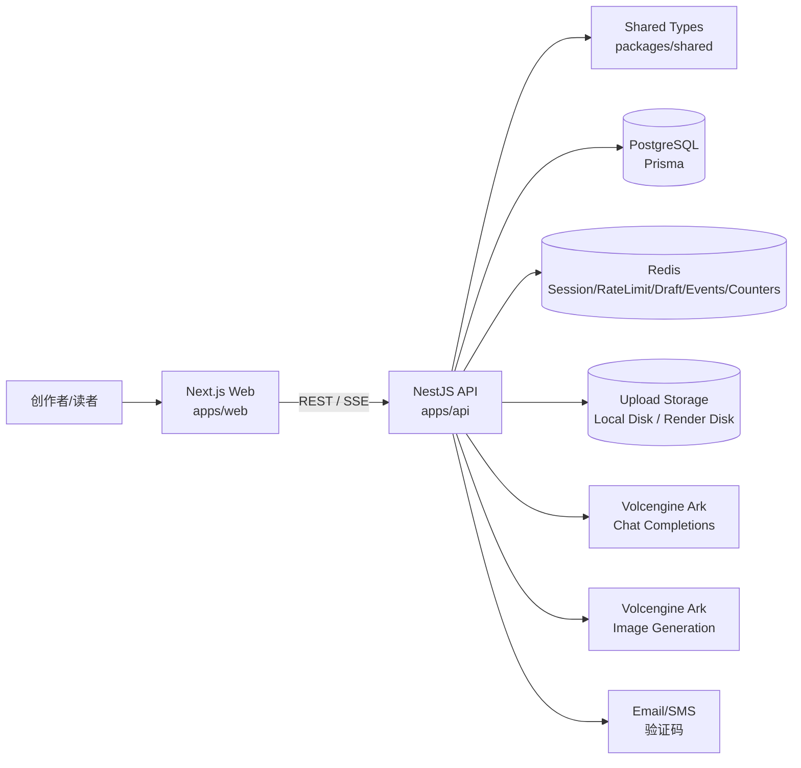
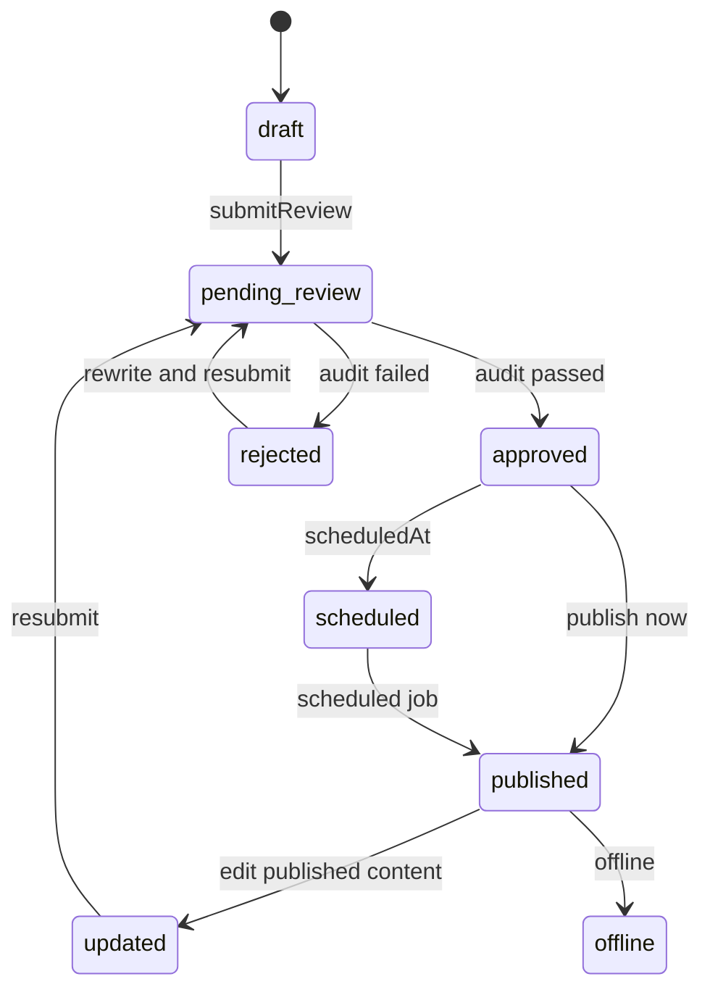
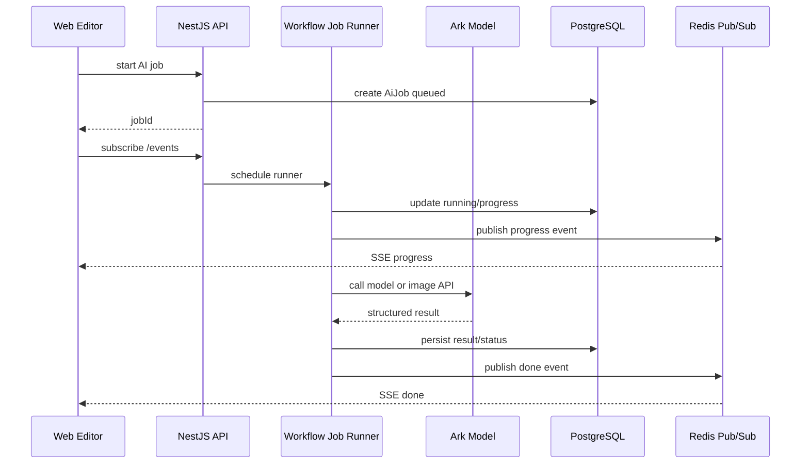

# 项目技术文档：今日头条 AI 创作者辅助生产与分发平台

> 本文基于当前仓库实现编写，覆盖系统架构、技术选型、核心模块、AI 接入、数据库、性能、可用性工程，以及安全审核规则和质量评估体系。

## 1. 系统架构设计

项目采用前后端分离的 Monorepo 架构，根目录通过 npm workspaces 管理 `apps/web`、`apps/api` 和 `packages/shared`。前端负责创作、审核、榜单和运营页面；后端负责鉴权、内容生命周期、AI 编排、审核评分、素材、榜单、统计和数据持久化；共享包沉淀前后端共同使用的状态枚举、请求响应结构和 AI 结果类型。



### 1.1 前端分层

前端基于 Next.js App Router 构建，主要页面包括：

- `dashboard`：创作者首页、数据看板、近期作品、热门话题。
- `editor`：富文本创作、AI 助手、素材、审核、评分和发布。
- `content`：作品管理、状态筛选、编辑和删除。
- `analytics`：素材管理、素材上传、审核状态和预览。
- `prompts`：Prompt 模板、版本、变量预览和测试用例。
- `rankings`：推荐榜、爆款榜、热度榜和官方话题。
- `contents/[id]`、`topics/[id]`、`users/[id]`：读者侧详情、话题和作者主页。

前端通过 `apps/web/lib/api.ts` 统一封装 API 调用，通过 `AuthProvider` 维护登录态，通过 `useAiJob` 消费 SSE AI 任务事件，通过 `useDraftAutosave` 实现本地与云端草稿同步。

### 1.2 后端分层

后端基于 NestJS 模块化组织，主要模块包括：

- `AuthModule`：注册、登录、验证码、访问令牌、刷新会话、登出黑名单。
- `UsersModule`：个人资料、偏好、公开主页、关注关系。
- `ContentsModule`：内容 CRUD、状态流转、版本、互动、评论、发布。
- `DraftsModule`：草稿读取、自动保存、Redis 缓存与数据库落库。
- `AiModule`：模型调用、AI Agent、AI Job、SSE、会话归档、图片生成。
- `ModerationModule`：审核工作流与异步审核任务。
- `AssetsModule`：素材上传、存储、图片描述、素材审核。
- `PromptsModule`：Prompt 定义、版本、预览、测试用例与 dry-run。
- `RankingsModule`：榜单、话题、话题详情。
- `AnalyticsModule`：用户行为埋点、指标聚合和趋势分析。
- `PrismaModule`、`RedisModule`：数据库和缓存基础设施。

### 1.3 内容生命周期

内容从草稿开始，经过审核、评分、发布和反馈进入榜单体系。安全审核失败的内容进入 rejected 状态，可以通过合规改写后再次提交审核。



### 1.4 AI 任务数据流

耗时 AI 能力通过 Job 机制运行，前端以 SSE 订阅进度和结果。这样可以避免长请求阻塞，也可以在生成图片、审核、合规改写等多阶段任务中持续反馈状态。



## 2. 技术选型与理由

| 层级 | 技术 | 选择理由 |
| --- | --- | --- |
| 前端框架 | Next.js 14 + React 18 | 支持 App Router、组件化开发和部署到 Vercel，适合快速构建前后台一体的 Web 应用 |
| UI 与样式 | Tailwind CSS v4 + lucide-react | 样式开发效率高，图标体系统一，便于构建轻量但完整的创作者后台 |
| 富文本编辑 | Tiptap | 基于 ProseMirror，支持扩展图片、表格、文本对齐、选区操作，适合 AI 改写和结构化插入 |
| 后端框架 | NestJS | 模块化、依赖注入、守卫、控制器和服务分层清晰，适合中大型业务服务 |
| ORM | Prisma | 类型安全、Schema 清晰、迁移与生成客户端方便，适合课程项目快速迭代 |
| 主数据库 | PostgreSQL | 适合存储用户、内容、版本、审核记录、质量评分、Prompt 版本和事件数据 |
| 缓存与实时 | Redis + ioredis | 用于会话、验证码、限流、草稿缓存、AI Job 事件、计数器和发布订阅 |
| AI 模型 | Volcengine Ark Chat Completions | 提供 OpenAI 兼容调用方式，便于在 `ModelClientService` 中统一封装模型请求 |
| 图片生成 | Volcengine Ark Images API | 支持由正文和封面提示词生成图文内容所需视觉素材 |
| 鉴权 | 自定义 HMAC Token + Redis Refresh Session | 轻量、可控，便于实现访问令牌过期、刷新、登出黑名单和多端会话 |
| 部署 | Vercel + Render + Render PostgreSQL/Redis | 前端和后端独立部署，数据库和缓存托管，符合课程项目交付和演示需求 |
| 共享类型 | `@aicp/shared` | 前后端共用内容状态、审核结果、AI Job、质量评分等结构，减少接口漂移 |

## 3. 核心模块设计

### 3.1 鉴权与用户模块

鉴权模块支持手机号和邮箱注册登录。验证码保存到 Redis，带 10 分钟过期时间；登录成功后生成访问令牌与刷新会话；登出时将访问令牌加入 Redis 黑名单，并删除刷新会话。后端通过 Guard 校验当前用户，前端通过 `AuthProvider` 和路由保护避免未登录用户访问创作后台。

用户模块提供个人资料、头像、简介、联系方式、默认平台、偏好风格、关注关系和公开主页。创作者偏好可以作为后续 AI 生成和推荐策略的个性化输入。

### 3.2 内容、草稿与版本模块

内容模块负责作品的创建、更新、删除、详情、发布、下线、互动和评论。内容实体同时保存 `bodyHtml` 与 `bodyJson`，既能支持前端富文本渲染，也能保留结构化编辑器状态。

草稿模块采用“双层保存”：

- 前端本地保存：降低网络波动导致的编辑丢失风险。
- 后端 Redis + PostgreSQL 保存：Redis 用于快速恢复最新草稿，PostgreSQL 用于长期持久化。

版本模块在内容重要变更时记录历史版本，支持后续回滚。这对 AI 辅助创作尤其重要，因为模型生成、人工编辑和合规改写可能频繁改变正文。

### 3.3 AI 创作生产线

AI 创作并不是单次 prompt 调用，而是通过 Skill 机制拆成多个阶段：

1. 需求分析：解析主题、受众、观点、素材和约束。
2. 草稿写作：生成适合信息流阅读的标题、正文、标签和大纲。
3. 视觉规划：生成封面建议和正文图片提示词。
4. 结构校验：校验标题、正文、标签、图片槽位和输出 JSON。
5. 图片生成：按封面和正文图片提示词生成图片素材。
6. 结果归一：将模型输出规范化为前端可直接消费的 `DirectGenerateResult`。

这一设计提升了 AI 结果的稳定性：模型负责创意生成，校验器负责格式与结构，前端负责把结构化结果映射到编辑器、素材栏和发布预览。

### 3.4 AI Job 与实时事件模块

AI Job 模块将长耗时任务抽象为可查询、可取消、可恢复的任务。任务状态包括 queued、running、succeeded、failed、cancelled 等，并保存进度、阶段结果、错误和最终输出。

前端发起任务后获取 `jobId`，再通过 SSE 订阅事件。后端使用 Redis Pub/Sub 推送进度，同时以数据库为最终状态来源。当 Redis 不可用或连接中断时，仍可以通过数据库轮询和最终任务详情恢复结果。

### 3.5 安全审核与合规改写模块

安全审核模块由规则引擎、语义审核 Agent、结果合并器和合规改写 Agent 组成。规则引擎负责快速发现风险片段，大模型负责结合上下文判断真实风险，合并器负责处理误伤、白名单语境、置信度和风险等级，合规改写负责生成可替换文本。

审核通过后内容进入 approved；审核失败则进入 rejected，并返回风险原因和改写建议。该模块既面向内容正文，也面向素材上传与图片描述审核。

### 3.6 质量评分模块

质量评分模块对已审核或待审核内容进行 0-100 分评估，输出五个维度得分、优点、问题和优化建议。评分结果保存到 `QualityScore`，并同步到 `Content.qualityScore`，用于创作者自查和后续榜单排序参考。

质量评分不决定内容是否违规，它是分发质量信号；安全审核才是发布门禁。

### 3.7 榜单、话题与数据分析模块

榜单模块提供推荐、爆款和热度三类排序：

- 推荐榜：更强调质量分和发布时间。
- 爆款榜：更强调热度、点赞、收藏、浏览和质量。
- 热度榜：更强调热度、浏览和质量。

话题模块从内容标签中聚合主题，并结合热度、质量、浏览、点赞、收藏和新鲜度计算话题分。数据分析模块记录浏览、点击、点赞、收藏、评论等事件，并生成 7 天或 30 天趋势。

### 3.8 Prompt 管理模块

Prompt 管理模块将 AI 生成、审核、评分和改写的模板从代码中抽离出来，支持：

- Prompt 定义与场景分类。
- Prompt 版本创建与激活。
- 模型名称、温度、输出结构配置。
- 变量预览和缺失变量检查。
- 测试用例与 dry-run 评估。

这使项目具备持续调优 AI 行为的能力。

## 4. AI 能力接入

### 4.1 模型调用封装

后端通过 `ModelClientService` 统一调用 Ark Chat Completions 接口。前端永远不直接访问模型 API，所有模型调用都由后端完成，从而保护 API Key，并便于统一记录日志、处理错误和控制模型参数。

关键环境变量包括：

- `ARK_API_KEY`：Ark 模型访问密钥。
- `ARK_API_URL`：聊天模型接口地址，默认使用 Ark OpenAI 兼容路径。
- `ARK_MODEL_ID`：默认聊天模型。
- `ARK_IMAGE_API_KEY`、`ARK_IMAGE_API_URL`、`ARK_IMAGE_MODEL_ID`、`ARK_IMAGE_SIZE`：图片生成配置。

### 4.2 Prompt 渲染与结构化输出

AI Agent 调用前会通过 Prompt 模板服务渲染变量。不同场景使用不同 Prompt 名称，例如直接生成、标题生成、安全审核、质量评分、合规改写和选区改写。

模型输出通过 `parseJsonObject` 和专用 validator 解析为结构化对象。对于一键生成图文，系统会进一步规范化：

- 标题不能为空，候选标题必须是数组。
- 标签统一补齐 `#` 前缀。
- 正文第一行不能重复标题。
- 图片提示词与正文图片槽位保持一致。
- 缺失的图片槽位会自动插入到合适位置。

### 4.3 多模态与图片生成

图片相关能力包括两类：

- 图片描述：上传图片后，在模型支持时生成图像语义描述，用于素材管理和安全审核。
- 图片生成：根据封面建议和正文图片提示词调用图片生成接口，结果保存为素材并关联内容。

图片生成任务支持并发控制、进度事件和失败告警。即使部分图片生成失败，文本草稿仍可返回给用户，避免整条创作链路因为单个图片失败而中断。

### 4.4 AI 调用日志与会话归档

每次关键 AI 调用会记录场景、模型、输入摘要、输出、耗时、是否成功和错误信息。对于创作助手类对话，系统还支持会话归档，便于后续恢复上下文和排查模型行为。

## 5. 数据库设计

数据库使用 PostgreSQL，Prisma Schema 定义在 `apps/api/prisma/schema.prisma`。核心数据实体如下：

| 数据域 | 主要模型 | 设计说明 |
| --- | --- | --- |
| 用户与偏好 | `User`、`UserPreference` | 保存账号、联系方式、头像、简介、创作偏好、关注计数 |
| 社交关系 | `UserFollow` | 保存用户关注关系，并同步 follower/following 计数 |
| 内容主体 | `Content` | 保存标题、正文 HTML/JSON、摘要、封面、标签、状态、质量分、热度和互动计数 |
| 内容素材 | `Asset`、`ContentAsset` | 保存上传素材、AI 生成素材、审核状态、元数据和内容关联 |
| 草稿与版本 | `Draft`、`ContentVersion` | 保存自动草稿、编辑器状态和可回滚版本 |
| 审核与评分 | `AuditRecord`、`QualityScore` | 保存安全审核结果、风险项、质量分维度、建议和模型信息 |
| AI 任务与日志 | `AiJob`、`AiCallLog`、`AiConversation`、`AiMessage` | 保存异步任务状态、模型调用记录、对话历史 |
| Prompt 运维 | `PromptDefinition`、`PromptVersion`、`PromptTestCase`、`PromptEvalRun`、`PromptEvalResult` | 支持 Prompt 版本化、测试用例和评估记录 |
| 互动与统计 | `ContentReaction`、`ContentComment`、`UserActionEvent` | 保存点赞、收藏、评论、浏览、点击等行为 |

核心枚举包括：

- 内容状态：draft、pending_review、approved、rejected、scheduled、published、updated、offline。
- Prompt 场景：generate、audit、score、rewrite。
- AI 任务类型：direct_generate、image_generate、submit_review、approve、moderation_run、compliance_rewrite。
- AI 任务状态：queued、running、succeeded、failed、cancelled。

数据库设计围绕内容生命周期展开：`Content` 是核心实体，向外关联素材、草稿、版本、审核、评分、评论、互动和用户行为。这样既能支撑创作者侧编辑，也能支撑读者侧分发和统计。

## 6. 性能优化

### 6.1 前端首屏与交互性能

榜单和内容列表采用分页与无限滚动，避免一次加载过多数据。图片组件提供固定比例、骨架屏、懒加载和错误兜底，减少布局抖动并提升感知速度。编辑器和素材面板使用本地状态与节流同步，避免每次输入都触发服务端请求。

针对作业中“榜单首屏 LCP 不高于 2.5s”的目标，当前项目采用以下策略：

- 首屏只请求有限数量的榜单内容和话题。
- 图片设置稳定尺寸与懒加载，首屏关键图可使用更高优先级。
- 排行榜使用 cursor 分页，后续内容通过 IntersectionObserver 追加。
- 前端不在首屏执行模型调用，AI 任务由用户操作后异步触发。

### 6.2 后端接口性能

后端将耗时 AI 能力放入异步 Job，接口快速返回 `jobId`，避免长时间阻塞 HTTP 请求。AI 任务进度通过 SSE 推送，用户可以在等待过程中看到阶段反馈。

Redis 承担高频和临时数据：

- 验证码、刷新会话、访问令牌黑名单。
- 登录与验证码限流。
- 草稿最新状态缓存。
- AI Job 事件发布订阅。
- 内容计数器增量缓存。

当 Redis 不可用时，部分核心能力仍以 PostgreSQL 为最终状态来源进行降级，提升可用性。

### 6.3 AI 任务性能

图片生成任务使用有限并发，避免同时发起过多模型请求导致失败率上升。AI 生产线按阶段返回进度和中间结果，即使图片生成失败，也可以保留文字草稿和告警信息。

模型输出采用结构化 JSON 校验和归一化，减少前端因为格式异常造成的二次失败。

### 6.4 数据查询优化方向

当前榜单查询主要依赖数据库排序和分页，站内规模下可以满足演示与课程项目需求。若后续扩展到更高并发，可以继续增强：

- 为 `status`、`visibility`、`publishedAt`、`heat`、`qualityScore` 增加面向榜单的复合索引。
- 使用 Redis ZSet 维护实时榜单候选集。
- 将浏览、点赞、收藏计数从 Redis 定时批量回写数据库。
- 对内容详情页做局部缓存，降低热门内容重复查询压力。

## 7. 可用性与工程设计

### 7.1 部署与环境

项目提供 Render 部署配置和 Vercel 前端部署说明。后端服务包含健康检查接口 `/api/health`，Render 中配置 PostgreSQL、Redis 和持久化上传磁盘。前端通过 `NEXT_PUBLIC_API_BASE` 访问后端 API。

生产环境建议流程：

1. 部署 PostgreSQL 和 Redis。
2. 配置 API 环境变量和上传磁盘。
3. 执行 Prisma 迁移。
4. 初始化 Prompt 种子数据。
5. 部署前端并配置 API 地址。

### 7.2 安全与权限

工程层面已经实现：

- 前端路由登录态保护。
- 后端 Guard 校验当前用户。
- 用户只能修改和发布自己拥有的内容。
- 访问令牌过期、刷新会话、登出黑名单。
- 验证码与登录限流。
- 文件类型与大小校验。
- 上传路径安全处理，避免非法路径写入。
- CORS 通过 `WEB_ORIGIN` 控制。
- 前端不暴露模型 API Key。

### 7.3 可观测性

系统记录多类运行数据：

- `AiCallLog`：模型调用、耗时、输出、错误。
- `AiJob`：异步任务状态、进度、阶段输出和失败原因。
- `AuditRecord`：审核结果、风险项和原因。
- `QualityScore`：质量分、维度和建议。
- `UserActionEvent`：浏览、点击、点赞、收藏、评论等行为。

这些数据既能支撑页面展示，也能用于后续问题排查、Prompt 迭代和审核效果评估。

### 7.4 工程脚本

根目录提供常用脚本：

- `npm run dev:web`：启动前端。
- `npm run dev:api`：启动后端。
- `npm run build`：构建共享包、API 和 Web。
- `npm run typecheck`：执行类型检查。
- `npm run db:generate`、`db:migrate`、`db:seed`、`db:seed:prompts`：数据库与 Prompt 初始化。

当前项目已具备较完整的工程结构和部署配置。后续建议补充正式单元测试、接口测试和审核样本评估报告，使质量保障更加完整。

## 8. 安全审核规则定义

安全审核体系由四层组成：风险分类、规则扫描、模型语义复核和结果合并。

### 8.1 风险分类

当前代码中的审核类型包括：

| 风险类型 | 含义 |
| --- | --- |
| pornography | 色情低俗、性暗示、涉黄交易等 |
| gambling | 赌博、博彩、下注、盘口、引流等 |
| drug | 毒品、违禁药物、交易和使用指导等 |
| sensitive | 敏感内容、敏感引流、平台不适宜表达等 |
| vulgar | 侮辱谩骂、粗俗表达、低质攻击性语言等 |
| privacy | 手机号、身份证、银行卡、邮箱、社交号等隐私泄露 |
| illegal | 违法犯罪、违规交易、危险操作等 |
| fraud | 诈骗、虚假承诺、诱导转账、可疑引流等 |
| minor | 涉未成年人不当内容或风险表达 |
| none | 未发现明显风险 |

风险等级分为 low、medium、high：

- low：轻微风险或表达不佳，通常可通过提示优化。
- medium：存在明确风险，需要拦截发布或要求改写。
- high：高危违规或强引流/违法风险，应直接阻断并优先改写或人工复核。

### 8.2 规则来源

规则库位于 `apps/api/src/modules/ai/safety`，通过文本词库文件维护。系统会递归加载 `.txt` 文件，根据文件名和目录名推断风险类型，并去重生成可扫描词条。

规则来源包括：

- 色情、赌博、毒品、辱骂、广告、暴恐、涉枪涉爆、非法网址、贪腐等词库。
- 联系方式、外部链接、二维码、群聊邀请等引流规则。
- 手机号、身份证号、邮箱、银行卡、微信号、QQ 号等隐私正则。
- 多类型组合规则，例如“赌博词 + 联系方式”“毒品词 + 交易词”“色情词 + 价格/联系方式”。

### 8.3 规则扫描策略

规则引擎扫描标题和正文，输出风险项。每个风险项包含：

- `type`：风险类型。
- `severity`：风险等级。
- `field`：命中的字段，如 title 或 body。
- `evidence`：命中的证据片段。
- `reason`：风险原因。
- `suggestion`：修改建议。
- `confidence`：规则置信度。
- `ruleId`：命中的规则标识。

扫描时会处理重叠命中并优先保留等级更高、置信度更高、证据更长的风险项。

### 8.4 白名单语境与误伤控制

内容平台中存在大量“反诈提醒”“禁毒宣传”“法律科普”“案例分析”等正向表达。如果只按关键词拦截，会产生较多误伤。

因此规则引擎内置安全语境白名单。当内容出现“禁毒宣传、反诈提醒、赌博危害、风险提示、不要参与、警惕、抵制”等表达时，系统会降低部分中风险词条的置信度，并交给大模型进一步判断，而不是直接拦截。

### 8.5 大模型语义复核

规则扫描后，系统会将命中的风险片段、标题、正文和可信 Skill 上下文传给安全审核 Agent。模型需要根据上下文判断：

- 规则命中是否真实构成违规。
- 是否属于科普、新闻、反诈、禁毒、法律提醒等正向语境。
- 是否存在隐私泄露、违法引导、诈骗引流等隐性风险。
- 是否需要改写。

模型必须返回可解析 JSON，包括 `passed`、`riskLevel`、`riskTypes`、`riskItems`、`categoryScores`、`reasons` 和 `rewriteAvailable`。

### 8.6 结果合并策略

最终审核不是简单相信规则或模型，而是由合并器综合判断：

- 高危组合规则可以直接形成阻断风险。
- 普通词库命中需要模型确认后才作为强阻断依据。
- 白名单语境下，如果模型判断风险不足，则降低或移除误伤风险。
- 同一位置或同一证据的风险项会去重。
- medium 和 high 风险会阻断发布；low 风险可作为优化提示。
- 合并后的 categoryScores 取规则和模型中更高的可信信号。

该策略兼顾召回率、可解释性和误伤控制。

### 8.7 审核干预闭环

项目中的安全治理闭环为：

1. **识别**：规则库和模型识别正文、标题、素材中的风险。
2. **干预**：中高风险内容阻断发布，返回风险原因和证据片段。
3. **改写**：合规改写 Agent 生成可直接替换的标题、正文和片段级 replacement。
4. **复审**：改写后的内容重新进入审核流程。
5. **记录**：审核结果保存到 `AuditRecord`，AI 调用保存到 `AiCallLog`。
6. **评估**：通过标注样本和评估脚本检查高危风险识别效果。

### 8.8 高危审核评估口径

仓库中提供了 `evaluate-high-risk-accuracy.cjs` 脚本，用于计算审核样本上的混淆矩阵、准确率、高危召回率、高危精确率、F1 和误报率。

建议课程提交时采用以下口径：

- 目标指标：高危风险召回率不低于 90%。
- 重点关注：high risk recall，避免高危内容漏放。
- 辅助关注：precision、F1、false positive rate，控制误伤。
- 样本来源：色情、赌博、毒品、隐私、诈骗、违法引流、正常科普、新闻报道、反诈提醒等正负样本。
- 评估产物：样本集、脚本输出、错误案例分析和规则/Prompt 迭代记录。

## 9. 质量评估体系

质量评估体系用于判断内容是否具有良好的阅读体验和传播潜力。它不替代安全审核，而是为创作者优化和榜单分发提供质量信号。

### 9.1 五维评分

质量评分总分为 100 分，由五个维度组成，每个维度 0-20 分：

| 维度 | 评估重点 |
| --- | --- |
| structure | 标题、导语、段落、层次、结尾是否清晰 |
| clarity | 表达是否清楚，语句是否顺畅，信息是否容易理解 |
| value | 是否提供有效信息、观点、经验、案例或实用价值 |
| attraction | 标题与开头是否有吸引力，是否适合信息流阅读 |
| compliance | 表达是否克制、客观、合规，是否存在夸张或风险措辞 |

模型返回维度得分、总分、优点、问题和建议。后端会对分数进行归一化和边界处理，保证每个维度在 0-20，总分在 0-100。

### 9.2 建议评分解释

为了便于产品展示，可以采用以下解释口径：

| 分数区间 | 解释 | 建议动作 |
| --- | --- | --- |
| 85-100 | 高质量内容 | 可优先发布，并作为推荐候选 |
| 70-84 | 达标内容 | 可以发布，建议根据问题继续优化 |
| 60-69 | 一般内容 | 建议优化结构、标题或信息增量后发布 |
| 0-59 | 低质量内容 | 建议重写或重新生成 |

该解释口径用于产品展示与运营说明，实际发布门禁仍以安全审核结果为准。

### 9.3 与榜单分发的关系

质量分会进入内容分发信号：

- 推荐榜优先考虑质量分、热度和发布时间。
- 爆款榜综合热度、点赞、收藏、浏览、质量和发布时间。
- 热度榜综合热度、浏览、质量和发布时间。
- 话题分会累加内容热度、质量、浏览、点赞、收藏和新鲜度。

当前话题聚合中的综合分可以概括为：

```text
topicScore = heat + qualityScore * 0.8 + viewCount * 0.05 + likeCount * 2 + collectCount * 3 + freshnessBoost
```

这意味着平台既鼓励内容获得互动，也鼓励内容保持较高质量，避免单纯依靠点击或短期热度进入榜单。

### 9.4 质量优化闭环

质量评估闭环为：

1. 创作者生成或编辑内容。
2. 平台完成安全审核。
3. 内容进入质量评分，得到五维分、优点、问题和建议。
4. 创作者根据建议优化标题、结构、信息密度和表达方式。
5. 发布后根据浏览、点赞、收藏、评论和榜单表现继续调整创作策略。

这套体系将 AI 从“代写工具”升级为“创作教练”：它不仅生成内容，也帮助创作者理解内容为什么好、哪里需要改、怎样更适合分发。
